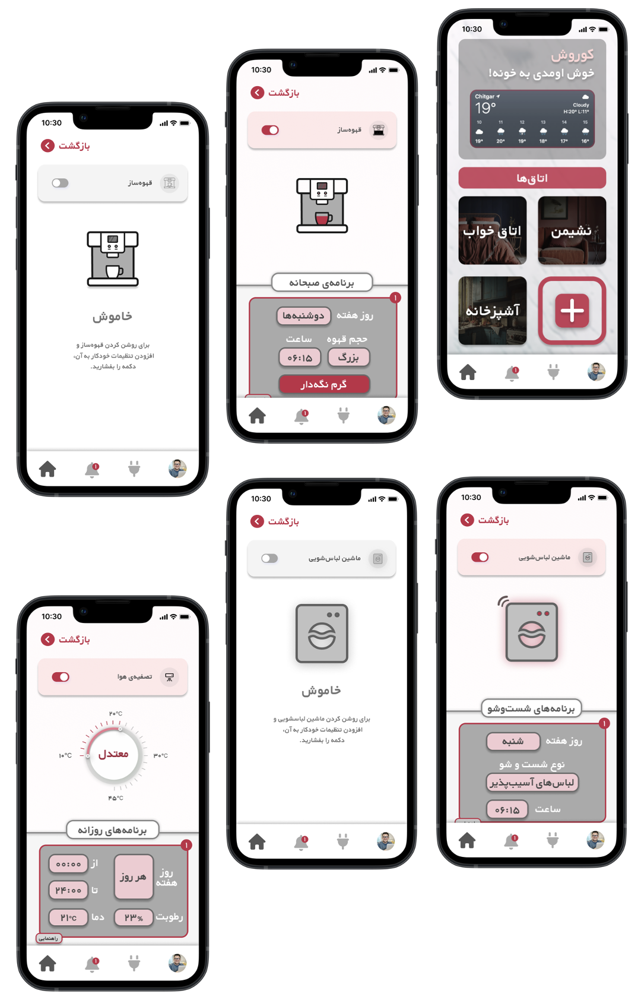

# Smart Home Automation Application Pilot

This project was developed as a final project for the <strong>SSE</strong> course taught by <strong>Dr. Habibi</strong> at <strong>Sharif University of Science and Technology</strong>. It focuses on the development and implementation of a smart home automation system designed to enhance convenience, security, and energy efficiency by integrating various smart devices and sensors throughout a household. The project leverages advanced technologies and platforms to create a seamless and user-friendly experience.

  

## Features

- <strong>Remote Control and Monitoring:</strong> Control and monitor your home appliances remotely using a mobile application.  
- <strong>Voice Integration:</strong> Compatible with voice assistants like Apple Home, Google Home, and Smart Things, enabling hands-free operation.  
- <strong>Automation Routines:</strong> Set up automated routines based on time, location, or specific triggers to simplify daily tasks.  
- <strong>Energy Management:</strong> Optimize energy consumption by automating the usage of devices based on real-time data.  
- <strong>Security Enhancements:</strong> Improve home security with smart locks, cameras, and motion sensors integrated into the system.

## Installation

- <strong>Hardware Setup:</strong> Install smart devices like lights, thermostats, cameras, and sensors in your home.  
- <strong>Software Configuration:</strong> Use the provided mobile application to connect and configure your devices.  
- <strong>Voice Assistant Integration:</strong> Follow the instructions to integrate with your preferred voice assistant platform.

## Usage

- <strong>Controlling Devices:</strong> Use the mobile app or voice commands to control your connected devices.  
- <strong>Monitoring:</strong> Keep track of your home’s status, including temperature, security alerts, and energy usage through the app.  
- <strong>Automating Tasks:</strong> Create and manage automation rules to trigger specific actions based on your preferences.

